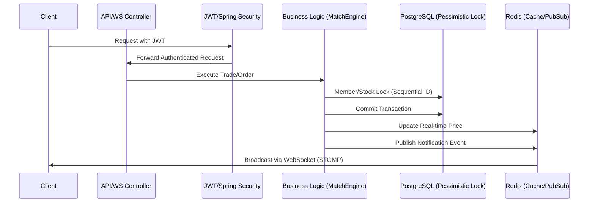

# 📈 StockSimulator: High-Concurrency Backend System

이 프로젝트는 대규모 트래픽 환경에서도 데이터의 정합성을 유지하며, 실시간으로 주식 주문을 체결하고 실시간 알림을 제공하는 **Spring Boot 기반의 고성능 주식 시뮬레이션 백엔드 시스템**입니다.

---

## 🏗️ 시스템 아키텍처 및 기술 스택

### 🛠 Backend Tech Stack
- **Framework**: Spring Boot 3.2.x, Java 17
- **Security**: Spring Security & **JWT** (Stateless Authentication)
- **Database**: PostgreSQL (JPA/Hibernate)
- **Concurrency Control**: **Pessimistic Locking (SELECT ... FOR UPDATE)** & **ID-based Sequential Locking**
- **Real-time Messaging**: Spring WebSocket (STOMP) & **Redis Pub/Sub**
- **Caching**: Redis (Real-time stock data & notification broadcasting)
- **Build Tool**: Gradle

### 📡 System Flow

---

## ⚙️ 핵심 기술 구현 (Core Backend Logic)

### 1. 매칭 엔진 (Matching Engine) 및 실시간 호가 처리
주문 체결의 핵심은 **가격/시간 우선순위**, **거래의 현실성**, 그리고 **데이터 정합성**입니다.
- **호가 및 단위 제약 (Order Book)**: 현실적인 주식 거래 경험을 제공하기 위해 `/api/orders/depth/{code}` API로 실시간 호가 데이터를 서빙하며, 지정가 주문 시 100원 단위의 가격만 입력할 수 있도록 엄격히 검증합니다.
- **지정가(Limit Order)**: 가격 합치 여부 확인 후 시간순 체결.
- **시장가(Market Order)**: 최유리 가격부터 즉시 스윕(Sweep), 미체결 잔량은 즉시 취소 처리.
- **정합성 검증**: 단순히 현재 잔고뿐만 아니라, `WAITING` 상태인 대기 주문의 총액/총수량을 합산하여 가용 자산을 실시간 검증합니다.

### 2. 고도화된 동시성 제어 및 데드락 방지
대량의 매수/매도 요청이 찰나의 순간에 몰리는 상황에서 데이터 파손과 시스템 중단을 방지합니다.
- **비관적 락(Pessimistic Lock)**: `SELECT ... FOR UPDATE`를 사용하여 트랜잭션 수준에서 자산 데이터를 보호합니다.
- **데드락 방지 (Deadlock Prevention)**: 
    - **ID-based Sequential Ordering**: 여러 계좌를 동시에 락킹해야 하는 체결 프로세스에서, 항상 **계좌 ID가 낮은 순서(`m1.getId() < m2.getId()`)대로** 락을 획득하도록 강제하여 서로의 자원을 기다리는 순환 대기(Circular Wait)를 원천 차단합니다.
    - 이를 통해 10,000건 이상의 동시 주문 테스트에서도 데드락 없이 안정적인 처리가 가능함을 검증했습니다.

### 3. 실시간 알림 및 시세 브로드캐스트
- **Redis Pub/Sub & WebSocket**: 서버 간 확장성을 고려하여 Redis의 발행/구독 모델을 채택했습니다. 체결 알림이나 시세 변화가 발생하면 Redis로 이벤트가 발행되고, 이를 구독 중인 서버들이 WebSocket(STOMP)을 통해 클라이언트에게 실시간으로 전송합니다.
- **Stateless Security**: JWT를 도입하여 세션 관리 부담을 줄이고 서버 확장성을 확보했습니다.

---

## 🚀 성능 및 부하 테스트 (Load Testing)

`Python/Thread` 기반 부하 테스트 스크립트를 통해 동시성 환경에서의 안정성을 검증했습니다.

### 10,000건 대량 부하 테스트 (Bulk Test)
- **대상**: 10,000건의 동시 주문 (매수/매도/지정가/시장가 랜덤 혼합)
- **결과**: 초기 데드락 이슈를 **ID 순차 락** 방식으로 해결한 후, 데이터 정합성 오류 없이 전량 처리에 성공했습니다.
- **주요 인사이트**: 동시성 제어 시스템에서는 '동적인 공정성'보다 '전역적인 일관성(Global Consistency)'이 데드락 방지의 가장 확실한 기초임을 확인했습니다.

---

## 🛠️ 최근 개선 사항 (Refactoring & Clean Code)

### 1. SOLID 원칙 적용
- **SRP (Single Responsibility Principle)**: 거대한 단일 서비스 클래스에서 벗어나, 매칭 엔진(`MatchTradeService`), 알림 전송(`NotificationService`), 실시간 시세 관리(`StockService`), HTTP 요청/응답 처리(`TradeController`) 로직을 각각의 전용 클래스로 책임을 분리하여 코드의 응집도와 가독성을 극대화했습니다.
- **DIP (Dependency Inversion Principle)**: 구체적인 구현이 아닌 인터페이스에 의존하도록 설계하여 확장성과 테스트의 유연성을 확보했습니다.

### 2. 보안 및 확장성
- **JWT Authentication**: OAuth2 확장성을 고려한 JWT 기반 인증 시스템 구축.
- **Global Exception Handling**: `@RestControllerAdvice`를 통한 체계적인 에러 응답 구조 설계.

---

## 👨‍🏫 Backend Interview Points
1. **왜 Pessimistic Lock인가요?**
   - 주식 거래는 데이터 정합성이 최우선입니다. 낙관적 락은 충돌 시 재시도 비용이 크고 로직이 복잡해질 수 있어, 비관적 락으로 확실한 순차 처리를 보장했습니다.
2. **데드락을 어떻게 해결했나요?**
   - 락 획득 순서를 계좌 ID 기준으로 고정하여 '순환 대기' 조건을 타파했습니다. 이는 분산 환경에서도 적용 가능한 가장 강력한 데드락 방지 전략입니다.
3. **Redis Pub/Sub을 사용한 이유는?**
   - 단일 서버의 WebSocket만으로는 서버 대수가 늘어날 때 알림 전파가 불가능합니다. Redis를 메시지 브로커로 사용하여 Multi-node 환경에서도 모든 유저에게 실시간 알림이 도달하도록 설계했습니다.
트러블슈팅 (Troubleshooting)

### 1. [Issue] 대량 주문 시 데이터베이스 데드락(Deadlock) 현상
- **상황**: 10,000건의 동시 주문 요청 시 PostgreSQL에서 `deadlock detected` 오류 발생.
- **원인 분석**:
    - 매칭 엔진 로직상 **주문자 A(Buyer) 잠금 -> 상대방 B(Seller) 자산 잠금** 순으로 진행됩니다.
    - 동시에 **주문자 B(Buyer) 잠금 -> 상대방 A(Seller) 자산 잠금** 요청이 들어오면 서로의 자원을 기다리는 순환 대기가 발생합니다.
    - 테스트 시 유저가 단 2명뿐이라 매칭 확률이 비정상적으로 높아져 현상이 두드러졌습니다.
- **해결 과정**:
    - **고정 잠금 순서(ID-based Sequential Locking)**: 단순히 계좌 ID가 낮은 순서로 락을 거는 규칙을 도입했습니다. 초기에는 특정 유저가 항상 우선권을 갖게 되는 불공정성(Starvation)을 우려해 XOR을 활용한 동적 방식을 검토했으나, 최종적으로 데이터베이스의 락 큐가 **FIFO(First-In-First-Out)**로 작동함을 확신하여 **별도의 연산 오버헤드 없이 '안전성(Deadlock-free)'과 '공정성'을 동시에 완벽히 확보**하는 ID 기반 락 방식을 채택했습니다.
- **교훈**: 동시성 제어 시스템에서는 복잡한 애플리케이션 레벨의 로직보다 데이터베이스의 기본 특성을 깊이 이해하고 활용하는 것이 **'전역적인 일관성(Global Consistency)'**을 지키는 가장 확실한 기초임을 체감했습니다.

### 2. [Q&A] 부하 테스트의 본질과 동시성
- **"1명이 쏘는 것과 여러 명이 쏘는 것의 차이는?"**
    - 1명의 사용자가 10,000번 호출하면 DB는 해당 유저를 줄 세워(Serialization) 처리하므로 데드락이 발생하지 않습니다.
    - 실제 운영 환경에서는 **수만 명의 다른 유저**가 찰나의 순간에 서로의 주식을 체결하려고 시도하며, 이때 발생하는 복합적인 락 경합이 진짜 부하 테스트의 대상입니다. 본 프로젝트는 소수 유저의 극한 매칭 상황을 가정하여 이 리스크를 미리 식별하고 방어했습니다.

---

## ⚡ Redis & WebSocket 활용

- **Redis**: 
  - `Hash` 구조를 사용해 각 주식의 실시간 현재가, 시가, 등락률을 캐싱하여 DB 부하를 최소화합니다.
  - `admin-open-market` 시점에 기준가를 Redis에 즉시 반영하여 대시보드 속도를 최적화했습니다.
- **WebSocket (STOMP)**:
  - 매칭 엔진에서 체결이 발생할 때마다 `/topic/stock` 채널로 실시간 시세를 브로드캐스트합니다.
  - 프론트엔드는 이를 수신하여 화면 새로고침 없이 호가창과 차트 정보를 갱신합니다.

---

## 👨‍🏫 면접 포인트 (Interview Tips)
1. **왜 Pessimistic Lock인가요?**
   - 주식 거래는 데이터의 정합성이 생명입니다. 낙관적 락(Optimistic Lock)은 충돌 시 재시도 비용이 크지만, 비관적 락은 확실한 순차 처리를 보장하여 비즈니스 복잡도를 낮추고 안전성을 높였습니다.
2. **시장가 주문의 잔여 수량 처리는?**
   - 시장가 주문은 "현재 가격으로 즉시 체결"이 목적이므로, 물량이 부족해 남은 양은 호가창에 남기지 않고 즉시 취소시키는 것이 일반적인 거래소의 스펙입니다. 프로젝트에도 이를 반영했습니다.
3. **Redis의 역할은?**
   - 단순한 시세 조회 성능을 높이기 위한 캐시 역할과, 스케일 아웃 환경에서 여러 서버가 동일한 시세를 공유할 수 있는 공유 메모리 역할을 수행합니다.
