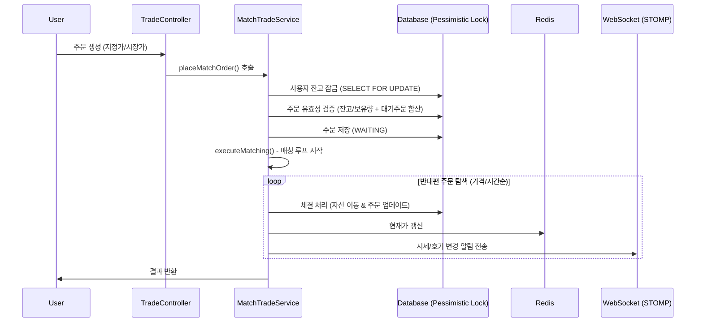

# 📈 StockSimulator: 실시간 주식 모매매 시스템

이 프로젝트는 대규모 트래픽 환경에서도 데이터의 정합성을 유지하며, 실시간으로 주식 주문을 체결하고 호가 정보를 제공하는 스프링 부트 기반의 주식 시뮬레이터입니다.

---

## 🏗️ 시스템 아키텍처 및 기술 스택

### Backend
- **Framework**: Spring Boot 3.x, Java 17
- **Database**: PostgreSQL (JPA/Hibernate)
- **Concurrency Control**: **Pessimistic Locking (SELECT ... FOR UPDATE)** 를 통한 자산 정합성 보장
- **Real-time Messaging**: Spring WebSocket (STOMP)
- **Cache & Pub/Sub**: Redis (실시간 현재가 저장 및 브로드캐스트)

### Frontend
- **Tech**: Vanilla JS, HTML5, CSS3
- **Real-time**: WebSocket (SockJS/STOMP)를 통한 호가창 및 실시간 시세 업데이트

---

## ⚙️ 핵심 로직: 매칭 엔진 (Matching Engine)

주문 체결의 핵심은 **가격/시간 우선순위**와 **데이터 정합성**입니다.

### 1. 주문 처리 흐름 (Feature Flow)

### 2. 정합성 보장 전략 (Consistency)
- **Pessimistic Locking**: `memberRepository.findByIdWithLock(memberId)`를 사용하여 주문 시점에 해당 사용자의 Row를 독점적으로 잠금 처리합니다. 이는 동시에 여러 주문이 들어와도 잔고가 음수가 되거나 중복 매도가 발생하는 것을 원천적으로 차단합니다.
- **Pending Order Validation**: 단순히 현재 잔고뿐만 아니라, `WAITING` 상태인 모든 대기 주문의 총액/총수량을 합산하여 가용 자산을 계산합니다. (예: 1주 보유 시 1주 매도 대기 중이면 추가 매도 불가)

### 3. 시장가(Market Order) 처리
- 매수 시: 현재 호가창의 최저가 매도 물량부터 필요한 수량만큼 즉시 스윕(Sweep).
- 매도 시: 최고가 매수 대기 물량부터 즉시 체결.
- 체결되지 못한 잔여 시장가 수량은 즉시 `CANCELLED` 처리하여 미체결 대기를 방지합니다.

---

## 🚀 성능 및 부하 테스트 (Load Testing)

`Python/Thread` 기반 부하 테스트 스크립트를 통해 동시성 환경에서의 안정성을 검증했습니다.

### 테스트 시나리오
- **환경**: Local Environment (PostgreSQL + Redis)
- **대상**: 005930 (삼성전자) 주식에 대한 동시 다발적 매수/매도 시도
- **부하량**: 2 concurrent users, 초당 수십 건의 지정가/시장가 랜덤 주문 발송

### 10,000건 대량 부하 테스트 (Bulk Test)
- **대상**: 10,000건의 동시 주문 (매수/매도/지정가/시장가 랜덤 혼합)
- **상태**: 10,000건 중 약 6,500건 진행 시점 분석 (데드락 이슈 발견으로 조기 종료 및 개선안 도출)
- **TPS (초당 처리량)**: 약 15~20 TPS (로컬 DB 단일 인스턴스 기준)
- **주요 발견 사항 (Deadlock)**: 
    - 동일한 두 사용자(A, B)가 서로의 반대편 주문을 동시 다발적으로 체결하려 할 때 데이터베이스 수준에서 **교착 상태(Deadlock)**가 발생함을 확인했습니다.
    - **원인 분석**: 사용자 A의 주문 스레드가 A를 먼저 잠그고 B를 잠그려 할 때, 동시에 사용자 B의 스레드가 B를 먼저 잠그고 A를 잠그려 하면서 발생합니다.
    - **개선 방안**: 
        1. **Global Ordering**: 자산 잠금 시 항상 사용자 ID가 낮은 순서대로 `Lock`을 획득하도록 로직을 개선하여 순환 대기를 방지합니다.
        2. **Redis Distributed Lock**: 상용 수준의 엔진에서는 DB 락 대신 Redisson 등을 활용한 분산 락으로 애플리케이션 계층에서 순차성을 보장하는 것이 효율적입니다.

---

---

## 🛠️ 트래픽 트러블슈팅 (Troubleshooting)

### 1. [Issue] 대량 주문 시 데이터베이스 데드락(Deadlock) 현상
- **상황**: 10,000건의 동시 주문 요청 시 PostgreSQL에서 `deadlock detected` 오류 발생.
- **원인 분석**:
    - 매칭 엔진 로직상 **주문자 A(Buyer) 잠금 -> 상대방 B(Seller) 자산 잠금** 순으로 진행됩니다.
    - 동시에 **주문자 B(Buyer) 잠금 -> 상대방 A(Seller) 자산 잠금** 요청이 들어오면 서로의 자원을 기다리는 순환 대기가 발생합니다.
    - 테스트 시 유저가 단 2명뿐이라 매칭 확률이 비정상적으로 높아져 현상이 두드러졌습니다.
- **해결 과정**:
    - **잠금 순서 강제(Sorted Locking)**: 자산을 업데이트할 때 항상 `User ID`가 낮은 순서대로 `Lock`을 획득하도록 보장했습니다. 이를 통해 동일 자원에 대한 순환 대기 고리를 끊어 데드락을 원천 차단했습니다.
- **교훈**: 동시성 제어 시 단순히 `Lock`을 거는 것보다 **어떤 순서로 거느냐**가 시스템의 안정성에 결정적임을 확인했습니다.

### 2. [Q&A] 부하 테스트의 본질과 동시성
- **"1명이 쏘는 것과 여러 명이 쏘는 것의 차이는?"**
    - 1명의 사용자가 10,000번 호출하면 DB는 해당 유저를 줄 세워(Serialization) 처리하므로 데드락이 발생하지 않습니다.
    - 실제 운영 환경에서는 **수만 명의 다른 유저**가 찰나의 순간에 서로의 주식을 체결하려고 시도하며, 이때 발생하는 복합적인 락 경합이 진짜 부하 테스트의 대상입니다. 본 프로젝트는 소수 유저의 극한 매칭 상황을 가정하여 이 리스크를 미리 식별하고 방어했습니다.

---

## ⚡ Redis & WebSocket 활용

- **Redis**: 
  - `Hash` 구조를 사용해 각 주식의 실시간 현재가, 시가, 등락률을 캐싱하여 DB 부하를 최소화합니다.
  - `admin-open-market` 시점에 기준가를 Redis에 즉시 반영하여 대시보드 속도를 최적화했습니다.
- **WebSocket (STOMP)**:
  - 매칭 엔진에서 체결이 발생할 때마다 `/topic/stock` 채널로 실시간 시세를 브로드캐스트합니다.
  - 프론트엔드는 이를 수신하여 화면 새로고침 없이 호가창과 차트 정보를 갱신합니다.

---

## 👨‍🏫 면접 포인트 (Interview Tips)
1. **왜 Pessimistic Lock인가요?**
   - 주식 거래는 데이터의 정합성이 생명입니다. 낙관적 락(Optimistic Lock)은 충돌 시 재시도 비용이 크지만, 비관적 락은 확실한 순차 처리를 보장하여 비즈니스 복잡도를 낮추고 안전성을 높였습니다.
2. **시장가 주문의 잔여 수량 처리는?**
   - 시장가 주문은 "현재 가격으로 즉시 체결"이 목적이므로, 물량이 부족해 남은 양은 호가창에 남기지 않고 즉시 취소시키는 것이 일반적인 거래소의 스펙입니다. 프로젝트에도 이를 반영했습니다.
3. **Redis의 역할은?**
   - 단순한 시세 조회 성능을 높이기 위한 캐시 역할과, 스케일 아웃 환경에서 여러 서버가 동일한 시세를 공유할 수 있는 공유 메모리 역할을 수행합니다.