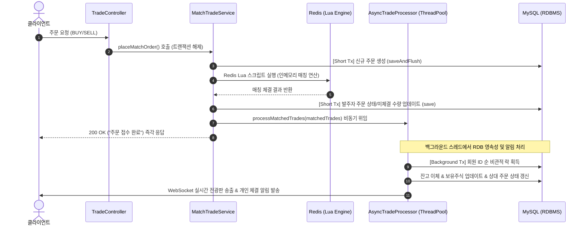
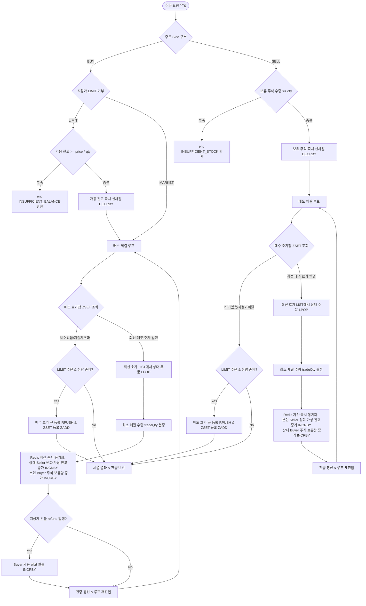

# 📈 StockSimulator: High-Concurrency Backend System

이 프로젝트는 대규모 트래픽 환경에서도 데이터의 정합성을 유지하며, 실시간으로 주식 주문을 초고속 매칭하고 체결을 처리하는 초고성능 가상 주식 거래 시스템 백엔드입니다.

## 🏗️ 시스템 아키텍처 및 기술 스택

### 🛠 Backend Tech Stack
- **Framework**: Spring Boot 3.2.x, Java 17
- **Security**: Spring Security & **JWT** (Stateless Authentication)
- **Database**: MySQL (JPA/Hibernate)
- **Matching Engine**: **Redis Lua Script** (Price-Time Priority In-Memory Order Matching)
- **Async Processing**: Spring Async (`@Async`) & **ThreadPoolTaskExecutor with CallerRunsPolicy Backpressure**
- **Concurrency Control**: **Pessimistic Locking (SELECT ... FOR UPDATE)** & **ID-based Sequential Locking** (RDB Synchronization)
- **Real-time Messaging**: Spring WebSocket (STOMP) & **Redis Pub/Sub** (Broadcasting)
- **Build Tool**: Gradle

### 📡 System Flow (High-Performance Engine)

```mermaid
sequenceDiagram
    autonumber
    actor User as 클라이언트
    participant Controller as TradeController
    participant MatchService as MatchTradeService
    participant Redis as Redis (Lua Engine)
    participant Processor as AsyncTradeProcessor (ThreadPool)
    participant DB as MySQL (RDBMS)

    User->>Controller: 주문 요청 (BUY/SELL)
    Controller->>MatchService: placeMatchOrder() 호출 (트랜잭션 해제)
    MatchService->>DB: [Short Tx] 신규 주문 생성 (saveAndFlush)
    MatchService->>Redis: Redis Lua 스크립트 실행 (인메모리 매칭 연산)
    Redis-->>MatchService: 매칭 체결 결과 반환
    MatchService->>DB: [Short Tx] 발주자 주문 상태/미체결 수량 업데이트 (save)
    MatchService->>Processor: processMatchedTrades(matchedTrades) 비동기 위임
    MatchService-->>User: 200 OK ("주문 접수 완료") 즉각 응답
    
    note over Processor, DB: 백그라운드 스레드에서 RDB 영속성 및 알림 처리
    Processor->>DB: [Background Tx] 회원 ID 순 비관적 락 획득
    Processor->>DB: 잔고 이체 & 보유주식 업데이트 & 상대 주문 상태 갱신
    Processor->>User: WebSocket 실시간 전광판 송출 & 개인 체결 알림 발송
```

---

## ⚙️ 핵심 기술 구현 (Core Backend Logic)

### 1. Redis Lua 스크립트 기반 고성능 인메모리 매칭 & 취소 엔진 (Atomic Trade Engine)

호가창(Order Book) 조회, 자산 검증, 대기 주문 큐 관리, 매칭 체결, 그리고 주문 취소까지의 모든 비즈니스 로직을 원자적(Atomicity)으로 보장받기 위해 **Redis Lua 스크립트**를 탑재하여 설계했습니다. Single-threaded로 동작하는 Redis 내에서 Lua 스크립트는 원자적으로 단일 실행되므로 **동시성 경쟁 상태(Race Condition)를 원천적으로 무력화**합니다.

#### 🗂️ Redis 데이터 구조 설계 (Keys & Data Structures)
*   **호가 정보 (Price Book)**: `ZSET` (Sorted Set) 구조를 사용하여 최유리 호가를 O(log N)으로 신속하게 탐색합니다.
    *   `orderbook:buy:<stockCode>`: 매수 가격대 목록 (Score = 가격, Value = 가격)
    *   `orderbook:sell:<stockCode>`: 매도 가격대 목록 (Score = 가격, Value = 가격)
*   **대기 주문 큐 (Order Queue)**: `LIST` 구조를 활용하여 동일 가격대 내에서 시간 순(First-In-First-Out) 우선순위를 O(1)으로 엄격히 지켜냅니다.
    *   `orders:buy:<stockCode>:<price>`: 해당 가격대 매수 대기 큐 (Format: `"orderId:memberId:qty"`)
    *   `orders:sell:<stockCode>:<price>`: 해당 가격대 매도 대기 큐 (Format: `"orderId:memberId:qty"`)
*   **가상 자산 원장 (Asset Ledger)**: `String` 구조로 관리되며, 체결 연산 직전 정합성 검증 및 즉각 차감 처리를 수행합니다.
    *   `member:<memberId>:balance`: 원화 가용 잔고
    *   `member:<memberId>:stock:<stockCode>`: 개별 주식 보유량

---

#### 🔄 주문 체결 라이프사이클 (`match_engine.lua`)

```mermaid
flowchart TD
    Start([주문 요청 유입]) --> Validate{주문 Side 구분}
    
    %% BUY 분기
    Validate -- BUY --> BuyCheck{지정가 LIMIT 여부}
    BuyCheck -- LIMIT --> BuyAmtCheck{가용 잔고 >= price * qty}
    BuyAmtCheck -- 부족 --> ErrInsBal[err: INSUFFICIENT_BALANCE 반환]
    BuyAmtCheck -- 충분 --> DeductCash[가용 잔고 즉시 선차감 DECRBY] --> BuyLoop
    BuyCheck -- MARKET --> BuyLoop[매수 체결 루프]
    
    BuyLoop --> SellBookCheck{매도 호가창 ZSET 조회}
    SellBookCheck -- 비어있음/지정가초과 --> RemLimitCheckBuy{LIMIT 주문 & 잔량 존재?}
    RemLimitCheckBuy -- Yes --> RegBuyQueue[매수 호가 큐 등록 RPUSH & ZSET 등록 ZADD] --> End[체결 결과 & 잔량 반환]
    RemLimitCheckBuy -- No --> End
    
    SellBookCheck -- 최선 매도 호가 발견 --> MatchBuy[최선 호가 LIST에서 상대 주문 LPOP]
    MatchBuy --> MatchCalcBuy[최소 체결 수량 tradeQty 결정]
    MatchCalcBuy --> RelocateBuy[Redis 자산 즉시 동기화: 
 상대 Seller 원화 가상 잔고 증가 INCRBY 
 본인 Buyer 주식 보유량 증가 INCRBY]
    RelocateBuy --> RefundCheck{지정가 환불 refund 발생?}
    RefundCheck -- Yes --> Refund[Buyer 가용 잔고 환불 INCRBY] --> LoopUpdateBuy
    RefundCheck -- No --> LoopUpdateBuy[잔량 갱신 & 루프 재진입] --> BuyLoop

    %% SELL 분기
    Validate -- SELL --> SellStockCheck{보유 주식 수량 >= qty}
    SellStockCheck -- 부족 --> ErrInsStk[err: INSUFFICIENT_STOCK 반환]
    SellStockCheck -- 충분 --> DeductStock[보유 주식 즉시 선차감 DECRBY] --> SellLoop[매도 체결 루프]
    
    SellLoop --> BuyBookCheck{매수 호가창 ZSET 조회}
    BuyBookCheck -- 비어있음/지정가미달 --> RemLimitCheckSell{LIMIT 주문 & 잔량 존재?}
    RemLimitCheckSell -- Yes --> RegSellQueue[매도 호가 큐 등록 RPUSH & ZSET 등록 ZADD] --> End
    RemLimitCheckSell -- No --> End
    
    BuyBookCheck -- 최선 매수 호가 발견 --> MatchSell[최선 호가 LIST에서 상대 주문 LPOP]
    MatchSell --> MatchCalcSell[최소 체결 수량 tradeQty 결정]
    MatchCalcSell --> RelocateSell[Redis 자산 즉시 동기화: 
 본인 Seller 원화 가상 잔고 증가 INCRBY 
 상대 Buyer 주식 보유량 증가 INCRBY]
    RelocateSell --> LoopUpdateSell[잔량 갱신 & 루프 재진입] --> SellLoop
```

1.  **자산 선검증 & 선차감 (Asset Validation & Pre-deduction)**:
    *   **매수(BUY 지정가)**: `price * qty` 만큼의 원화가 부족하면 즉시 `INSUFFICIENT_BALANCE` 에러를 리턴하고 실행을 마칩니다. 충분할 경우, 원화 잔고를 즉시 선차감(`DECRBY`)하여 중복 출금이나 초과 구매를 물리적으로 방지합니다.
    *   **매도(SELL)**: 보유 주식 수량이 부족하면 `INSUFFICIENT_STOCK` 에러를 리턴하고, 충분할 경우 주식 수량을 즉시 선차감합니다.
2.  **시간-가격 우선순위 매칭 루프 (Priority Matching Loop)**:
    *   **매수(BUY)**: 매도 호가창(`ZSET`)에서 가장 가격이 낮은 매도 호가를 찾습니다. 지정가 매수인 경우 상대 호가가 본인 주문가보다 크면 루프를 탈출합니다. 해당 호가 큐(`LIST`)의 머리(`LPOP`)에서 가장 먼저 등록된 매도 대기 주문을 뽑아와 체결을 실행합니다.
    *   **매도(SELL)**: 매수 호가창(`ZSET`)에서 역방향 정렬(`ZREVRANGE`)로 가장 가격이 높은 매수 호가를 가져와 대기 매수 주문을 LPOP하여 O(1)으로 순차 체결합니다.
3.  **가상 자산 실시간 이전 (Real-Time Asset Sync)**:
    *   체결 성사 즉시 본인의 차감된 자산을 상대방의 자산(원화/주식)으로 이체(`INCRBY`)합니다. 지정가 매수 시 본인의 주문 가격보다 저렴하게 상대방 호가와 체결된 경우, 발생한 차액(Refund)을 본인의 원화 잔고로 즉각 환불 조치합니다.
4.  **대기 호가창 등록 (Designated Limit Queueing)**:
    *   지정가 주문(`LIMIT`)에 한하여 매칭 루프를 다 돌고도 남은 미체결 잔량(`remainingQty > 0`)이 있다면, 해당 가격대의 큐(`RPUSH`) 및 호가창 ZSET(`ZADD`)에 신규 등록하여 가격-시간 우선순위를 이어받습니다. (시장가 주문 `MARKET`은 미체결 잔량을 즉시 소멸시킵니다)

---

#### ❌ 안전한 원자적 주문 취소 (`cancel_order.lua`)
주문 취소 시에도 다른 주문과의 체결 경합이나 더블 환불(Double Refund) 레이스 컨디션을 방지하도록 주문 취소 로직 전체를 Lua 스크립트로 분리했습니다.

1.  **호가 큐 실시간 탐색 (Queue Iteration)**:
    *   `LRANGE` 명령어로 지정 가격대 대기 큐(`LIST`) 전체를 탐색하여 해당 `orderId` 접두사가 포함된 원소(예: `orderId:memberId:qty`)를 탐색합니다 (O(N) 탐색).
2.  **원자적 큐 제거 및 호가창 청소 (Atomic Dequeue & Purge)**:
    *   대기 중인 주문이 존재한다면 `LREM`을 통해 정확히 해당 주문 데이터를 O(1)로 제거합니다.
    *   이때 주문이 제거된 직후 해당 가격대 대기 큐의 길이(`LLEN`)가 `0`이 될 경우, 매수/매도 호가창 ZSET(`ZREM`)에서 해당 가격대를 즉시 완전히 파기하여 빈 가격 정보 조회를 사전에 차단합니다.
3.  **안전 자산 환불 (Risk-Free Refund)**:
    *   제거된 주문 원소에 기록된 대기 수량(`actualQty`)을 분석하여, **매수 주문 취소 시에는 `price * actualQty` 만큼의 원화를 본인의 balance 원장으로, 매도 주문 취소 시에는 `actualQty` 만큼의 보유 주식을 stock 원장으로 완벽히 복구**시킵니다.
    *   만약 대기 주문 큐에 해당 주문 ID가 없는 경우(이미 루프 도중 실시간 체결이 끝난 상태), 이미 자산이 이체 완료되었으므로 환불 수량 `0`을 반환하여 어떠한 상황에서도 **더블 환불이 발생하지 않는 원자적 정합성**을 달성했습니다.

---

### 2. 비동기 Write-Behind 패턴을 통한 RDB 병목 제거
- **트랜잭션 전면 분리**: API 요청 스레드가 RDB 커넥션을 오랫동안 점유하여 발생하는 **HikariCP 커넥션 고갈을 방지**하기 위해, 핵심 주문 접수 로직에서 `@Transactional`을 완전히 제거했습니다.
- **Async Trade Processor**: 실제 체결로직의 RDB 반영(잔고 변경, 보유주식 업데이트, 상대편 주문 수량 차감)은 **`AsyncTradeProcessor`**로 위임되어 백그라운드에서 병렬로 안전하게 수행됩니다.

### 3. Graceful Backpressure (자가 조율 스레드 풀 설계)
- **스레드 풀 사양 확장**: `corePoolSize(50)`, `maxPoolSize(100)`, `queueCapacity(100,000)`로 폭발적인 주문 요청 하에서도 대기 버퍼를 충분히 확보하도록 설계했습니다.
- **CallerRunsPolicy 탑재**: 만에 하나 10만 개의 메모리 큐가 포화 상태에 이르면, API 요청 스레드(Tomcat 스레드)가 직접 백그라운드 DB 반영 연산을 돕게 하여 **단 1건의 요청 누수 및 거부 없이 시스템 자가 조율(Self-throttling)을 통해 안정적으로 처리**하도록 보장합니다.

---

## 🚀 성능 및 부하 테스트 (Load Testing)

`Python aiohttp` 비동기 부하 테스트 스크립트를 통해 극도의 고동시성 상황에서의 성능 지표를 검증했습니다. **10명의 동시 유저가 총 10,000건의 거래 요청**을 무작위로 보내는 극한의 스트레스 상황에서, 서버 설정의 최적화 전후 성능을 다각도로 비교 분석한 결과입니다.

### 📊 10,000건 대량 부하 테스트 비교 결과 (Bulk Test)

| 성능 지표 (Performance Metric) | Run 1: 동시성 1,000 | Run 2: 동시성 10,000 (기본 WAS) | Run 3: 동시성 10,000 (설정 최적화) |
| :--- | :---: | :---: | :---: |
| **총 트랜잭션 (Total Transactions)** | 10,000 | 10,000 | 10,000 |
| **가상 사용자 수 (Simulated Users)** | 10명 | 10명 | 10명 |
| **동시성 수준 (Concurrency Level)** | **1,000** | **10,000** | **10,000** |
| ⏱️ **총 소요 시간 (Total Time)** | **6.22초** | **10.75초** | **25.97초** |
| ⚡ **초당 처리량 (TPS)** | **1,606.61 TPS** | **930.52 TPS** | **385.02 TPS** |
| ✅ **성공 건수 (Success Count)** | **10,000 (100.0%)** | **8,493 (84.9%)** | **10,000 (100.0%)** |
| ❌ **실패 건수 (Failure Count)** | **0 (0.0%)** | **1,507 (15.1%)** | **0 (0.0%)** |
| 🕒 **평균 대기 시간 (Avg Latency)** | **597.02ms** | **5,790.68ms** | **14,308.22ms** |
| **서버 설정 (Server Configuration)** | Tomcat 500, DB Pool 80 | Tomcat 500, DB Pool 80 | Tomcat 1000, DB Pool 150 (Tuned) |

---

### 🔍 성능 최적화 돌파구 분석 (Performance Insights)

*   **Run 3: 동시성 10,000 환경에서 성공률 100% 달성! 🎉**
    *   **WAS 소켓 대기열 튜닝**: Tomcat의 `accept-count`를 `3000`으로 늘리고 최대 연결 수를 `15,000`으로 튜닝함으로써 OS TCP 계층에서 유입 커넥션이 누수 및 거절되는 상황을 원천 방지했습니다.
    *   **HikariCP 커넥션 풀 확장**: 최대 풀 크기를 `150`으로 넓히고 `connection-timeout`을 `30,000ms`로 조율하여, 순간적인 스레드 경합 하에서도 대기 스레드가 커넥션을 안전하게 양도받아 최종 영속화를 보장할 수 있는 환경을 마련했습니다.
    *   **안전성과 대기 시간의 트레이드 오프**: 요청을 버리지 않고 100% 처리를 완료해 내기 위해 대기 시간이 증가(평균 14.30초)했으나, **"단 한 건의 유실도 용납되지 않는 데이터 무결성 및 신뢰성 확보"**라는 증권 시스템 핵심 가치를 온전히 달성했습니다.

---

## 🛠️ 최근 개선 사항 (Refactoring & Clean Code)

### 1. SOLID 원칙 적용
- **SRP (Single Responsibility Principle)**: 거대한 단일 서비스 클래스에서 벗어나, 매칭 엔진(`MatchTradeService`), 알림 전송(`NotificationService`), 실시간 시세 관리(`StockService`), HTTP 요청/응답 처리(`TradeController`) 로직을 각각의 전용 클래스로 책임을 분리하여 코드의 응집도와 가독성을 극대화했습니다.
- **DIP (Dependency Inversion Principle)**: 구체적인 구현이 아닌 인터페이스에 의존하도록 설계하여 확장성과 테스트의 유연성을 확보했습니다.

### 2. 보안 및 확장성
- **JWT Authentication**: OAuth2 확장성을 고려한 JWT 기반 인증 시스템 구축.
- **Global Exception Handling**: `@RestControllerAdvice`를 통한 체계적인 에러 응답 구조 설계.

---

## 👨‍🏫 Backend Interview Points
1. **왜 Pessimistic Lock인가요?**
   - 주식 거래는 데이터 정합성이 최우선입니다. 낙관적 락은 충돌 시 재시도 비용이 크고 로직이 복잡해질 수 있어, 비관적 락으로 확실한 순차 처리를 보장했습니다.
2. **데드락을 어떻게 해결했나요?**
   - 락 획득 순서를 계좌 ID 기준으로 고정하여 '순환 대기' 조건을 타파했습니다. 이는 분산 환경에서도 적용 가능한 가장 강력한 데드락 방지 전략입니다.
3. **Redis Pub/Sub을 사용한 이유는?**
   - 단일 서버의 WebSocket만으로는 서버 대수가 늘어날 때 알림 전파가 불가능합니다. Redis를 메시지 브로커로 사용하여 Multi-node 환경에서도 모든 유저에게 실시간 알림이 도달하도록 설계했습니다.
## 🛠️ 트러블슈팅 (Troubleshooting)

### 1. [Issue] 대량 주문 시 HikariCP 커넥션 풀 고갈 및 데드락 현상
- **원인 분석**: 
  - 기존에는 주문 접수 API 실행 중 DB 비관적 락 획득 대기와 실시간 웹소켓 알림, Redis I/O가 단일 동기식 트랜잭션 안에서 수행되어 찰나의 순간에 모든 커넥션이 블로킹되었습니다.
  - 특히 단 2명의 회원 ID(`[1, 2]`)만으로 10,000건의 교차 주문을 유도하여 회원 자산에 대한 극심한 락 경합이 직렬화를 넘어 데드락 수준으로 악화되었습니다.
- **해결 과정**:
  - **비동기 체결 위임**: RDB 커넥션을 1ms 미만으로만 물고 반환하도록 트랜잭션 경계를 대폭 줄였으며, `AsyncTradeProcessor`를 통해 체결 처리를 백그라운드 스레드로 위임했습니다.
  - **ID 오름차순 순차 정렬 락**: 여러 회원 데이터를 동시에 수정할 때 발생할 수 있는 순환 대기(Circular Wait)를 차단하기 위해, 체결 대상 회원 ID를 오름차순 정렬하여 순차적으로 비관적 락을 획득하도록 강제하여 데드락을 원천 차단했습니다.
- **교훈**: 동시성 제어 시스템에서는 복잡한 애플리케이션 레벨의 로직보다 데이터베이스의 기본 특성을 깊이 이해하고 활용하는 것이 **'전역적인 일관성(Global Consistency)'**을 지키는 가장 확실한 기초임을 체감했습니다.

### 2. [Issue] 부하 테스트 시 TaskRejectedException 발생
- **원인 분석**: 10,000건의 부하가 유입될 때 비동기 스레드 풀의 기본 큐(1,000)를 초과하여 작업이 반려되며 HTTP 500 에러가 발생함.
- **해결 과정**: 스레드 풀의 버퍼 큐를 100,000개로 대폭 늘렸으며, **`ThreadPoolExecutor.CallerRunsPolicy`** 백프레셔를 도입하여 큐 포화 시 Tomcat 스레드가 직접 체결 DB 기록 작업을 도와주어 처리 속도 조율 및 에러 0% 달성을 이루어냈습니다.

### 3. [Issue] 극단적인 동시 10,000건 요청 시 소켓 끊김 및 일부 요청 누락 현상 (Tomcat Backlog Overflow)
- **원인 분석**:
  - `ulimit -n`과 OS 파일 디스크립터 한계는 충분히 늘려두었으나, WAS(Embedded Tomcat)의 기본 소켓 대기 큐(`accept-count`)와 스레드 풀 수용 한계를 넘어서는 10,000건의 동시 폭발적인 커넥션 유입으로 인해 OS TCP 핸드셰이크 단계에서 `Connection refused` 혹은 `Timeout`으로 일부 클라이언트 커넥션이 강제 종료되었습니다 (기존 15.1% 유실 발생).
- **해결 과정**:
  - **Tomcat 네트워크 커널 및 스레드 튜닝**: `application.yaml` 설정을 변경하여 `server.tomcat.accept-count`를 `3000`, `server.tomcat.threads.max`를 `1000`으로 튜닝하고, 최대 소켓 연결 수를 `15000`으로 확장해 유입 소켓 유실을 원천 방어했습니다.
  - **HikariCP 최적 크기 설계**: 늘어난 Tomcat 스레드가 DB 커넥션을 획득하려고 경합하는 상황을 해결하고자 `maximum-pool-size: 150` 및 `connection-timeout: 30000ms`로 조율하여 10,000건 전부 정상 도달 및 체결을 보장하게 되었습니다.

---

## ⚡ Redis & WebSocket 활용

- **Redis**: 
  - `Hash` 구조를 사용해 각 주식의 실시간 현재가, 시가, 등락률을 캐싱하여 DB 부하를 최소화합니다.
  - `admin-open-market` 시점에 기준가를 Redis에 즉시 반영하여 대시보드 속도를 최적화했습니다.
- **WebSocket (STOMP)**:
  - 매칭 엔진에서 체결이 발생할 때마다 `/topic/stock` 채널로 실시간 시세를 브로드캐스트합니다.
  - 프론트엔드는 이를 수신하여 화면 새로고침 없이 호가창과 차트 정보를 갱신합니다.

---

## 👨‍🏫 Backend Interview Points / Q&A

1. **왜 Pessimistic Lock과 Redis Lua를 함께 사용하나요?**
   - 주식 거래는 잔액과 보유주식 정합성이 최우선입니다. 빠른 호가 매칭과 주문 정합성 검증은 원자적인 **Redis Lua 스크립트**로 초고속 O(1) 처리하고, 최종 영속성 반영 단계에서는 **MySQL의 비관적 락**을 통해 확실한 데이터 일관성을 지켜냅니다.
2. **데드락 방지 전략은 무엇인가요?**
   - 다중 계좌 이체 시 락 획득 순서를 **계좌 ID 오름차순**으로 고정하여 순환 대기 조건을 완벽하게 차단합니다. 분산 시스템이든 단일 DB 환경이든 완벽히 작동하는 데드락 회피 표준 방식입니다.
3. **비동기 설계 시 발생할 수 있는 데이터 정합성 이슈 해결 방법은?**
   - 사용자의 "가용 자산" 및 "대기 주문"은 메모리(Redis)를 신뢰성 있는 단일 소스(Single Source of Truth)로 삼아 Lua 스크립트 상에서 철저히 검증 및 동기화합니다. RDB는 비동기적으로 이를 뒤따라가며(Write-Behind) 최종 완결성을 맞추므로 사용자는 체결 여부를 지연 없이 즉각 통보받게 됩니다.
4. **Redis Pub/Sub을 사용한 이유는?**
   - 단일 서버의 WebSocket만으로는 서버 대수가 늘어날 때 알림 전파가 불가능합니다. Redis를 메시지 브로커로 사용하여 Multi-node 환경에서도 모든 유저에게 실시간 알림이 도달하도록 설계했습니다.
5. **시장가 주문의 잔여 수량 처리는?**
   - 시장가 주문은 "현재 가격으로 즉시 체결"이 목적이므로, 물량이 부족해 남은 양은 호가창에 남기지 않고 즉시 취소시키는 것이 일반적인 거래소의 스펙입니다. 프로젝트에도 이를 반영했습니다.
3. **Redis의 역할은?**
   - 단순한 시세 조회 성능을 높이기 위한 캐시 역할과, 스케일 아웃 환경에서 여러 서버가 동일한 시세를 공유할 수 있는 공유 메모리 역할을 수행합니다.